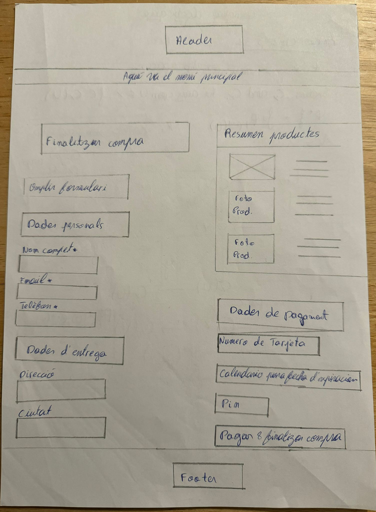

# P0_wireframe

# Part Victor

# Tarea Achraf Chakir

# Cistella de Compra i Checkout:

Per començar, aquest wireframe mostra la pàgina del carret de compra com funció general. A la part superior, es manté el header amb el menú de navegació (Per no repetir ho he posat d'aquesta forma). A la part central es llisten els productes que l'usuari ha afegit al carret, amb la seva imatge, una mini descripció amb detalls importants; preu i una opció per modificar-ne la quantitat o eliminar-los. A la dreta, es mostra un resum de la comanda amb el total a pagar i les opcions de pagament. A la part inferior, es poden veure productes suggerits relacionats i els botons de "Continuar per pagar" i "Seguir comprant". El footer es troba al final de la pàgina (Aqui he fet lo mateix que el header).

# Checkout: 

Aquest wireframe mostra la pàgina de finalització de la compra (checkout). El menú principal es manté a la part superior. La pàgina es divideix en dues columnes: a l'esquerra, l'usuari pot omplir les seves dades personals (nom, email, adreça, etc.) i la informació d'enviament. A la dreta, es mostra un resum dels productes seleccionats amb la seva imatge, descripció i preu. A la part inferior dreta es troben els camps per introduir les dades de pagament (número de targeta, data de caducitat i PIN), i el botó per finalitzar la compra. A la part inferiores manté el footer.

# Blog i noticies:

Aquest wireframe representa la pàgina del blog i notícies de la botiga. A la part superior hi ha el header, on s'inclou el menú principal de navegació. A la part central es mostren diferents articles (Productes nous de la botiga) cadascun amb una imatge, un títol i un resum,  Notícies sobre guitarres, també inclou una secció per mostrar feches dels proxims events importants relacionats amb la m´sica i guitarres, A la part inferior de la pàgina hi ha el footer.

